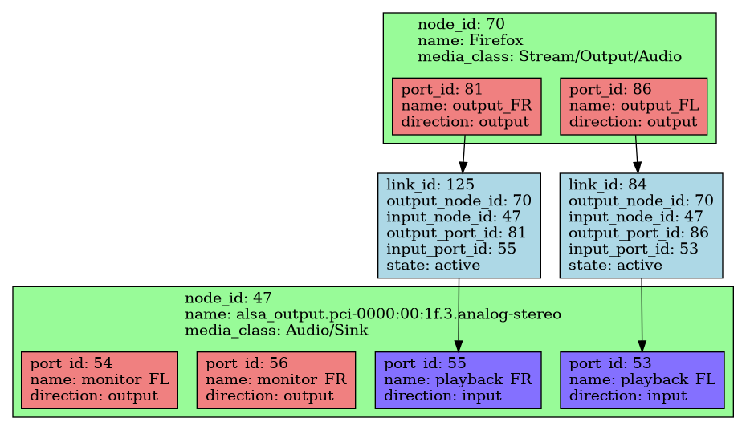

========================================
PipeWire
========================================

.. contents:: 目錄

介紹
========================================

:site: https://pipewire.org/
:repo: https://gitlab.freedesktop.org/pipewire/pipewire/

* 涵蓋目前 PulseAudio 和 JACK 的使用情境，具有相容層
* 提供一致的方式來同時支援一般桌面應用和專業低延遲應用
    - 一般桌面應用：較低耗電、延遲不是特別重要、手動設定的東西越少越好
    - 專業低延遲應用：穩定且低的延遲、耗電不是特別重要、彈性的使用者設定
    - PipeWire 根據應用程式的需求可以動態地切換模式，藉此專業應用者不需要再重新學另一套設定
* 除了音訊外，還支援影像，提供和音訊同等的彈性和管理給攝影機、桌面視窗等
* 提供 sandbox 應用程式的支援
* 支援 GStreamer

.. code-block:: sh

    sudo pacman -S pipewire pipewire-pulse

如果使用比較輕量的視窗管理而沒有 D-Bus 啓動的話，
可以在 ``~/.xinitrc`` 裡面補上：

.. code-block:: sh

   if which dbus-launch >/dev/null && test -z "$DBUS_SESSION_BUS_ADDRESS"; then
       eval `dbus-launch --sh-syntax --exit-with-session`
   fi

可以使用以下指令檢查：

.. code-block:: sh

    systemctl status --user pipewire
    # 如果有使用 pipewire-pulse 的話
    systemctl status --user pipewire-pulse
    # 如果有使用 pipewire-pulse 的話，
    # 會看到類似「Server Name: PulseAudio (on PipeWire 0.3.20)」
    pactl info

PipeWire v.s. PulseAudio
========================================

PulseAudio 的目標是桌面應用，
這也包含在 PipeWire 的目標內。
既有的 PulseAudio 在一些情境下有使用過多 CPU 的問題，
而且延遲的問題在既有設計下無法定改善。

使用 pipewire-pulse 的話可以直接把 PipeWire 當做 PulseAudio 使用，
藉此可以輕易的替換測試！

PipeWire v.s. JACK
========================================

PipeWire 和 JACK 有許多相似的設計，
例如 scheduling 和 graph model，
但是主要類似採用 PulseAudio 的 timer-based wakup。

另外相比 JACK 還多支援了格式溝通、動態裝置、動態延遲調整、sandbox 支援等等。

工具
========================================

.. code-block:: sh

    $ pw-dump
    [
      {
        "id": 0,
        "type": "PipeWire:Interface:Core",
        "version": 3,
        "permissions": [ "r", "w", "x", "m" ],
        "info": {
          "cookie": 629914341,
          "user-name": "user",
          "host-name": "archlinux",
          "version": "0.3.20",
          "name": "pipewire-0",
          "name": "pipewire-0",
          "change-mask": [ "props" ],
          "props": {
            "core.name": "pipewire-0",
            "context.profile.modules": "none",
            "core.daemon": true,
            "link.max-buffers": 16,
            "default.clock.rate": 48000,
            "default.clock.quantum": 1024,
            "default.clock.min-quantum": 32,
            "default.clock.max-quantum": 8192,
            "default.video.width": 640,
            "default.video.height": 480,
            "default.video.rate.num": 25,
            "default.video.rate.denom": 1,
            "mem.allow-mlock": true,
            "cpu.max-align": 64,
            "object.id": 0
          }
        }
      },
      {
        "id": 1,
        "type": "PipeWire:Interface:Module",
        "version": 3,
        "permissions": [ "r", "w", "x", "m" ],
        "info": {
          "name": "libpipewire-module-rtkit",
          "filename": "/usr/lib/pipewire-0.3/libpipewire-module-rtkit.so",
          "args": null,
          "change-mask": [ "props" ],
          "props": {
            "module.name": "libpipewire-module-rtkit",
            "object.id": 1,
            "module.author": "Wim Taymans <wim.taymans@gmail.com>",
            "module.description": "Use RTKit to raise thread priorities",
            "module.usage": "[nice.level=<priority: default -11>] [rt.prio=<priority: default 20>] [rt.time.soft=<in usec: default 200000] [rt.time.hard=<in usec: default 200000] ",
            "module.version": "0.3.20",
            "nice.level": -11,
            "rt.prio": 20,
            "rt.time.soft": 200000,
            "rt.time.hard": 200000
          }
        }
      },
      ...
    ]

.. code-block:: sh

    # dump all into DOT file
    $ pw-dot
    # dump all into DOT file (linked objects only)
    $ pw-dot -s

    # graphviz
    $ dot -Tpng pw.dot > pw.png

.. code-block:: sh

    $ pw-top
    S   ID PERIOD/RATE      WAIT    BUSY   W/P   B/P  ERR  NAME

    !   28      0/0        0.0  s   0.0  s  0.00  0.00    0  Dummy-Driver
    !   38      0/0        0.0  s   0.0  s  0.00  0.00    0  Midi-Bridge
    !   43      0/0        0.0  s   0.0  s  0.00  0.00    0  v4l2_output.pci-0000:00:14.0-usb-0:9:1.0
    !   45      0/0        0.0  s   0.0  s  0.00  0.00    0  v4l2_output.pci-0000:00:14.0-usb-0:9:1.2
    !   48      0/0        0.0  s   0.0  s  0.00  0.00    0  alsa_output.pci-0000:00:1f.3.analog-stereo
    !   49      0/0        0.0  s   0.0  s  0.00  0.00    0  alsa_input.pci-0000:00:1f.3.analog-stereo
    !   62      0/0        0.0  s   0.0  s  0.00  0.00    0  bluez_input.FF:FF:FF:FF:FF:FF.a2dp-sink

參考
========================================

* `Wikipedia - PipeWire <https://en.wikipedia.org/wiki/PipeWire>`_
* `Arch Wiki - PipeWire <https://wiki.archlinux.org/index.php/PipeWire>`_
* `Arch Wiki - Talk:PipeWire <https://wiki.archlinux.org/index.php/Talk:PipeWire>`_
* `Gentoo Wiki - PipeWire <https://wiki.gentoo.org/wiki/Pipewire>`_
* `PipeWire FAQ <https://gitlab.freedesktop.org/pipewire/pipewire/-/wikis/FAQ>`_
* [2020] `PipeWire: a low-level multimedia subsystem <https://lac2020.sciencesconf.org/307881/document>`_
    - 古早的 Linux 音訊支援是 OSS (Open Sound System)，而且是 Linux 2.4 以前唯一的音訊 API，基於 open/close/read/write/ioctl
    - Linux 2.5 用 ALSA (Advanced Linux Sound Architecture) 取代了 OSS
    - OSS 和 ALSA 都有同時只能有一個應用程式能使用特定裝置的限制
    - 後來 ALSA 實作了軟體混音器插件（Dmix），但是有很多缺陷，使用也不夠有彈性
    - EsounD (ESD) 爲早期的 sound server 之一，使用 socket 來接收許多音訊，在送出去之前先混合，使用 TCP，而且不支援低延遲
    - BSD 有另一套簡單的音訊 API 叫 sndio，這 API 也支援 midi，它用 Unix pipe 來傳送音訊，而且也不支援低延遲
    - 2002 年，Paul Davis 基於 Ardour 內的音訊引擎實作了 JACK，提供及時、低延遲的應用給音訊和 midi
        + JACK 內維護一個應用程式的流線圖，各個點之間用 port 連接，使用 device interrupt 來叫醒程式去處理資料
        + JACK 雖然支援低延遲，但是缺少一些桌面應用需要的功能，例如 format support/power saving/dynamic devices/volume control/security/...
    - PulseAudio 是模組化的現代音訊伺服器，和先前的實作相比，可以支援自動且動態地建立和配送給多裝置
        + PulseAudio 雖然支援省電應用，但是需要花費過多 CPU 來叫醒程式
    - PipeWire 基於先前的經驗，提供改善和相容
        + 起源於要在 sandbox 環境內使用音訊硬體，但是後來設計上又有了更多改進
        + 有相容層給 JACK 和 PulseAudio，既有的應用程式不需要改動就能使用
        + 架構中一個重要的角色是 session manager，管理裝置的設定和控制策略
        + 應用程式和音訊伺服器的協定本身爲非同步
        + 格式溝通採用和 GStreamer 一樣的格式描述，可以在兩端點間取交集找到合適的溝通格式

* [2020] `PipeWire Late Summer Update 2020 — Christian F.K. Schaller <https://blogs.gnome.org/uraeus/2020/09/04/pipewire-late-summer-update-2020/>`_
* [2020] `PipeWire, the media service transforming the Linux multimedia landscape <https://www.collabora.com/news-and-blog/blog/2020/03/05/pipewire-the-media-service-transforming-the-linux-multimedia-landscape/>`_
* [2020] `WirePlumber, the PipeWire session manager <https://www.collabora.com/news-and-blog/blog/2020/05/07/wireplumber-the-pipewire-session-manager/>`_
* [2019] `FOSDEM 2019 - Pipewire <https://fosdem.org/2019/schedule/event/pipewire/attachments/slides/2826/export/events/attachments/pipewire/slides/2826/PipeWire.pdf>`_
* [2019] `PipeWire in the Automotive Industry - GStreamer conferences <https://gstconf.ubicast.tv/videos/pipewire-in-the-automotive-industry/>`_
* [2018] `Getting the team together to revolutionize Linux audio <https://blogs.gnome.org/uraeus/2018/09/24/getting-the-team-together-to-revolutionize-linux-audio/>`_
